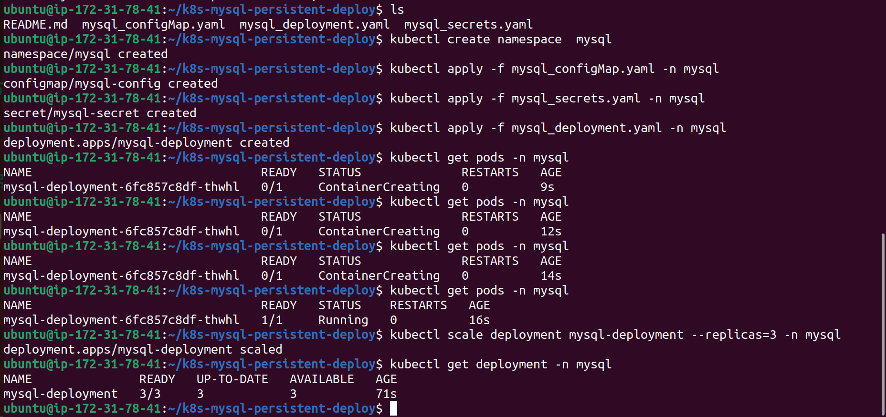
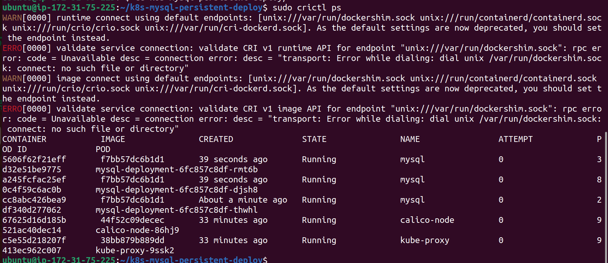
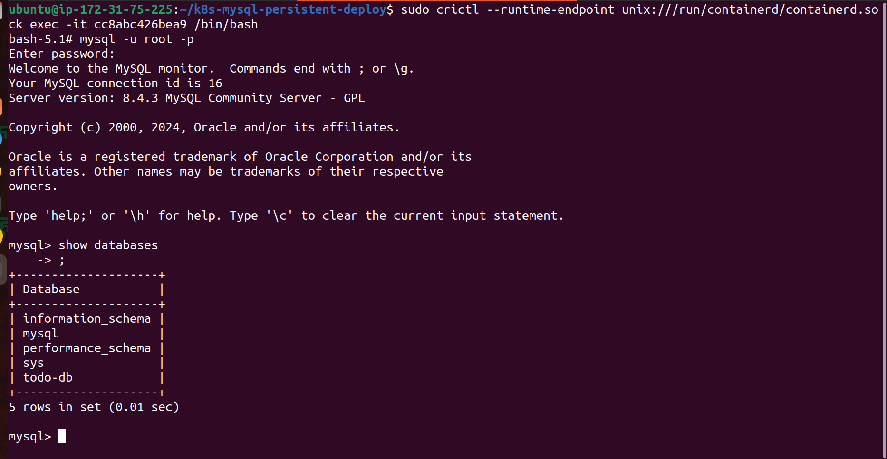
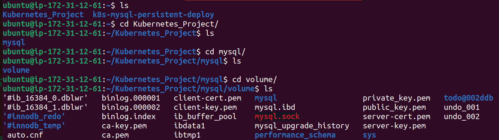

# k8s-mysql-persistent-deploy
A Kubernetes-based deployment of MySQL, leveraging ConfigMaps, Secrets, and Persistent Volumes for secure and scalable database management.

## Table of Contents
- **Overview**
- **Pre-requisites**
- **Deployment Steps**
- **Accessing the MySQL Database**
- **Directory Structure**
- **Screenshots**

## Overview
The setup includes:
- **ConfigMap:** For non-sensitive configuration.
- **Secret:** To store sensitive data such as passwords.
- **Persistent Volume and Claim:** For data persistence.
- **Deployment:** To manage MySQL pods.

## Pre-requisites
Ensure you have the following:
- A Kubernetes cluster running (e.g., Minikube, AWS EKS, GKE, etc.)
- kubectl installed and configured to interact with the cluster.

## Deployment Steps
Run the following commands in order to set up the MySQL deployment:
### 1. Apply ConfigMap:
```bash
kubectl apply -f mysql_configMap.yaml
```
This stores non-sensitive configuration values like MySQL database names.

### 2. Apply Secret:
```bash
kubectl apply -f mysql_secrets.yaml
```
This securely stores sensitive values such as MySQL passwords.

### 3. Set up Persistent Volume (PV):
```bash
kubectl apply -f mysql_persistent_volume.yaml
```
### 4. Set up Persistent Volume Claim (PVC):
```bash
kubectl apply -f mysql_persistent_volume_claim.yaml
```

### 5.Deploy MySQL:
```bash
kubectl apply -f mysql_deployment.yaml
```

## Accessing the MySQL Database
### Connect to the MySQL Pod:
```bash
kubectl exec -it <mysql-pod-name> -- /bin/bash
```
### Access the MySQL Shell:
```bash
mysql -u <username> -p
```

Replace <mysql-pod-name> with the name of the MySQL pod and <username> with your database username.

## Directory Structure
```bash
k8s-mysql-persistent-deploy-main/
│
├── mysql_configMap.yaml            # Kubernetes ConfigMap
├── mysql_secrets.yaml              # Kubernetes Secret
├── mysql_persistent_volume.yaml    # Persistent Volume definition
├── mysql_persistent_volume_claim.yaml # Persistent Volume Claim definition
├── mysql_deployment.yaml           # MySQL Deployment manifest
├── images/                         # Screenshots or diagrams
```
## Verify
### On Master Node:


### On Worker Node:






